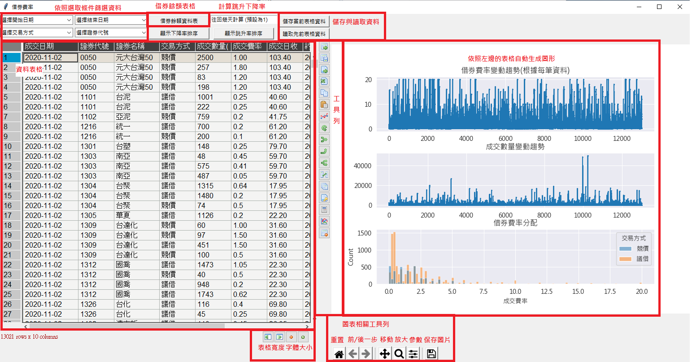
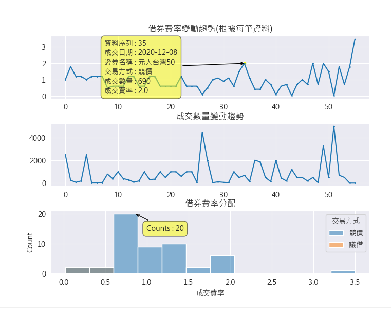
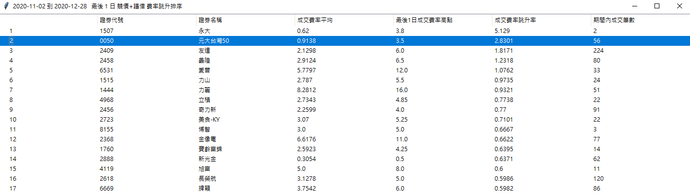
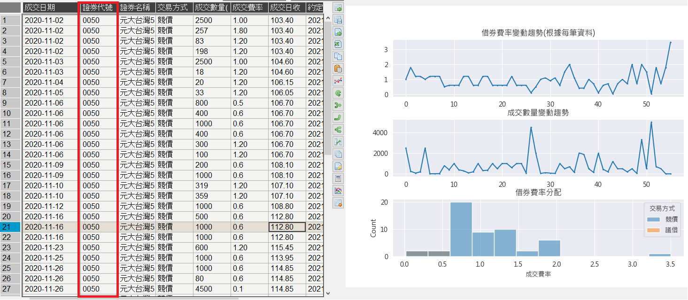
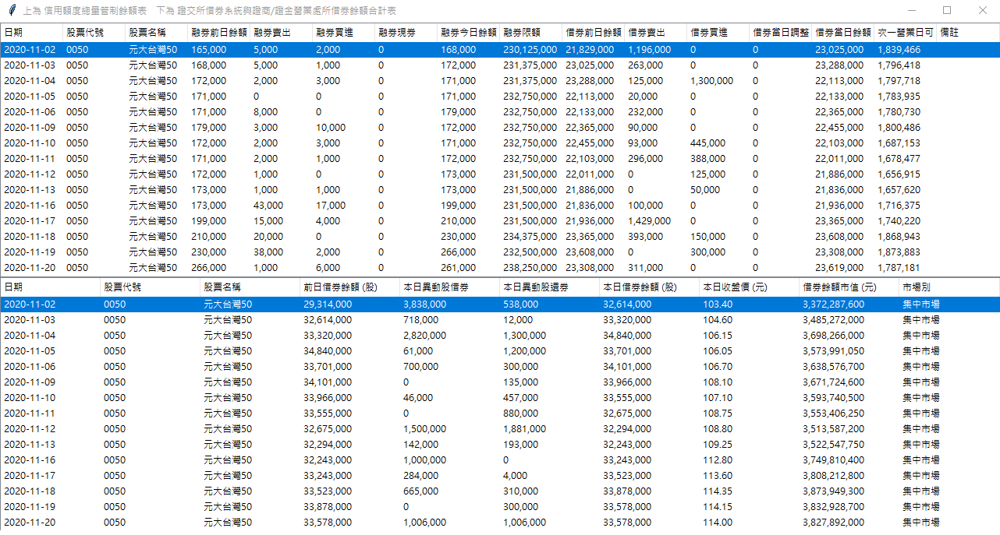

# 程式說明

### 此程式主要功能是到台灣證券交易所的[借券資料](https://www.twse.com.tw/zh/page/trading/SBL/t13sa710.html)頁面中爬取資料並呈現

### 另外也爬取以下資料作為輔助:
* [信用額度總量管制餘額表](https://www.twse.com.tw/zh/page/trading/exchange/TWT93U.html)
* [證交所借券系統與證商/證金營業處所借券餘額合計表](https://www.twse.com.tw/zh/page/trading/exchange/TWT72U.html)

# 資料夾說明

* app : 主程式的資料夾，打開後選擇<b>app.exe</b>即可使用
* img : 為本說明文件相關圖片
* QuotaData : 輔助表格<信用額度總量管制餘額表>、<證交所借券系統與證商/證金營業處所借券餘額合計表>的爬蟲程式與資料存放位置

# 設定檔說明

本檔案有三個設定檔：<b>Date_Setting</b>、<b>Core_Setting</b>以及<b>QuotaData_Setting</b>

* <b>Date_Setting.txt</b>檔案中有4個參數，中間採用半形冒號: 
    * START
    * END
    * BATCH
    * HISTORICAL_DATA
* <b>Core_Setting.txt</b>檔案中有7個參數，中間採用半形冒號: 
    * TABLE_WIDTH
    * TABLE_HEIGHT
    * PLOT_WIDTH
    * PLOT_HEIGHT
    * POPUP_WIDTH
    * POPUP_WIDTH_QUOTA
    * POPUP_HEIGHT_QUOTA
* <b>QuotaData_Setting.txt</b>檔案中有4個參數，中間採用半形冒號:
    * START
    * CREDIT_TABLE
    * SYSTEM_TABLE
    * CONVERT_CSV

# Date_Setting參數說明

* START：指定抓取資料期間開始日期
* END：指定抓取資料期間結束日期
* BATCH：是否採用批次抓取的方式抓取資料
* HISTORICAL_DATA：是否採用過去保存的歷史資料進行分析

## 參數使用情境

(1) 預設情境，無定義日期時，預設使用上個月月初作為開始時間，抓取截至今天為止的資料

        - START:
        - END:
        - BATCH:
        - HISTORICAL_DATA:

(2) 設定開始日，無定義結束日期時，使用設定的開始時間，抓取截至今天為止的資料
        
        - START:2020-09-10
        - END:
        - BATCH:
        - HISTORICAL_DATA:

(3) 設定開始日與結束日，使用設定的開始時間，抓取截至設定的截止日期的資料

        - START:2020-09-10
        - END:2020-10-23
        - BATCH:
        - HISTORICAL_DATA:

(4) 設定開始日與結束日，以及啟用批次下載功能，此時則會將所選的時間區間，以每個月每個月下載再做合併。由於資料區間較大時，直接大量抓取容易產生錯誤，此時可以考慮採用此抓取方式。但是要避免短期內送出太多請求被TWSE鎖，所以每次請求完需要使電腦短暫休眠，運行速度較慢。另外，當批次功能開啟時，也會將此次抓取後儲存爬取的資料為"<b>最近一次批次抓取資料.csv</b>"。

        - START:2019-03-10
        - END:2020-10-23
        - BATCH:T
        - HISTORICAL_DATA:
        
(5) 設定開始日，以及啟用批次下載功能，此時則會將所選的時間區間，依照批次的方式，抓取截至今天為止的資料，並且也會儲存。

        - START:2019-03-10
        - END:
        - BATCH:T
        - HISTORICAL_DATA:
        
(6) 設定HISTORICAL_DATA，直接使用過去保存的資料集，如此一來會跳過抓資料階段，因此其他三個參數就沒有作用了。

        - START:
        - END:
        - BATCH:
        - HISTORICAL_DATA:最近一次批次抓取資料.csv
        

# Core_Setting參數說明

* TABLE_WIDTH：資料表格的寬度大小，其單位是當前螢幕的比例
* TABLE_HEIGHT：資料表格的高度大小，其單位是當前螢幕的比例
* PLOT_WIDTH：右邊圖表的寬度大小
* PLOT_HEIGHT：右邊圖表的高度大小
* POPUP_WIDTH：跳升與下降率視窗的寬度
* POPUP_WIDTH_QUOTA：借券額度視窗的寬度
* POPUP_HEIGHT_QUOTA：借券額度視窗的高度

# QuotaData_Setting參數說明

* START：資料開始的日期
* CREDIT_TABLE：<信用額度總量管制餘額表>檔案名稱
* SYSTEM_TABLE:<證交所借券系統與證商/證金營業處所借券餘額合計表>檔案名稱
* CONVERT_CSV:是否要將現有資料轉存出CSV檔

# 介面說明

* 篩選欄位：成交日期開始與結束、交易方式、證券代號。 如果要回到全選，則將選項調回預設的位置即可。
* 借券餘額表格：跳出表格選取股票的<信用額度總量管制餘額表>與<證交所借券系統與證商/證金營業處所借券餘額合計表>
* 計算跳升下降率：依照最近幾天的跳升率來做排序
* 儲存表格資料：按下之後，將會保存當下的篩選資料為CSV檔，並存在APP底下的目錄，以時間戳記來命名。
* 讀取表格資料：按下之後，將會跳出檔案選擇視窗，可以讀取之前保存的相同欄位設定的CSV檔。
* 資料表格：右下方的四個按鈕，分別為欄位縮小、欄位放大、字體縮小、字體放大

* 圖表類別：
    1. 費率折線圖：現在篩選的資料中，依照資料序列呈現借券費率的變化。X軸是各筆資料、Y軸是借券費率
    2. 數量折線圖：現在篩選的資料中，依照資料序列呈現成交數量的變化。X軸是各筆資料、Y軸是成交數量
    2. 分配圖：現在篩選的資料中，借券費率的分布。X軸為借券費率、Y軸為累計次數、顏色則代表不同的交易方法
    
    
* 圖表相關工具列：提供圖表檢視相關的工具

# 提示工具

### 如圖所示，可以用滑鼠點擊右方的圖，取得詳細資訊
* 折線圖：提供該筆資料的序列、成交日期、證券名稱、交易方式、成交數量、成交費率
* 分配圖：提供該區間實際的累積數量

# 費率跳升排序

### 找出成交費率有跳升的個股，並提供反向選取

* 可以設定：

    * 往回找高點的天數
    * 交易方式
    * 資料開始與結束日期
    
    
* 依照現有的資料表格進行以下計算：

    1. 選取要往回看幾天找跳點，預設為1
    2. 每個證券分開計算，並依照是否為最後幾天分為兩組資料
    3. 最後幾天的資料中，計算成交費率的最高值。(如果最後幾天沒有交易的標的則會剔除)
    4. 最後幾天以外的資料的資料中，計算成交費率的平均數
    5. 將兩者計算跳升率$\frac{成交費率跳升率}{最後<i>日成交費率最高點}-1$
    6. 依照跳升率進行排序，並記錄期間內發生的總交易筆數，輔助篩選
    

# 借券餘額資料表

### 依照主表格選取到的個股，顯示借券餘額資料

# 借券餘額資料維護

### 檔案夾中主要有兩個檔案：
* credit_data_table.pickle：信用額度總量管制餘額表
* system_table.pickle：證交所借券系統與證商/證金營業處所借券餘額合計表

點選<b>crawler.exe</b>後，會讀取上述兩個表格資料，並且找到資料中的最後一個交易日，再依序抓取到今天，為了避免漏抓，如果表格資料最後一天是今天，這樣仍然會抓取今天的資料，再進行重複值去除的動作。之後這兩個表格會被主程式讀取做使用

# 其他版本差異
* 當Date_Setting以及Core_Setting不存在於 app.exe 的上層目錄時，開啟app時會自動建立並給予預設值
* 爬取資料時增加亂數產生的header以及休眠秒數，減少被鎖的機會
